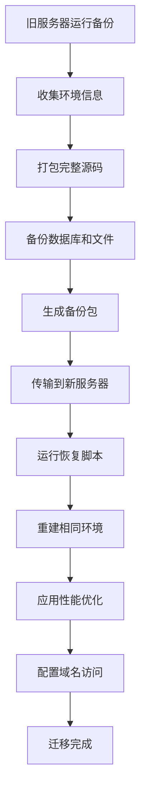

# Odoo 源码部署迁移工具


专为源码部署的Odoo系统设计的智能迁移工具，一键完成从旧服务器到新服务器的完整环境迁移。

## 📋 项目概述

**odoo-migrate.sh** 是专为源码部署Odoo系统设计的智能迁移工具。它能够：

1. **在旧服务器上**：自动收集Odoo版本、源码位置、Python库、数据库版本等完整环境信息，并打包成单个备份文件
2. **在新服务器上**：根据备份信息精确重建原环境，确保迁移后的系统与原系统完全一致

### 🎯 核心特性

- ✅ **智能环境收集** - 自动检测Odoo进程、配置文件、版本信息
- ✅ **完整源码备份** - 包含所有可能的源码修改和自定义内容
- ✅ **精确版本匹配** - 严格按照原环境的Python、Odoo、PostgreSQL版本恢复
- ✅ **双恢复模式** - 支持源码部署（推荐）和Docker容器化部署
- ✅ **性能安全优化** - 自动应用生产级性能调优和安全加固
- ✅ **高性能Nginx配置** - 多层缓存、安全防护、SSL自动配置
- ✅ **中文PDF支持** - 自动解决中文字体和PDF显示问题

### 🔄 迁移流程



## 🚀 快速开始

### 环境要求

- **旧服务器**: 运行中的Odoo源码部署（17.0或18.0版本）
- **新服务器**: Ubuntu 20.04/22.04 或 Debian 11/12
- **网络**: 两台服务器之间可传输文件

### ⚠️ 重要提示

**关于域名迁移**：
- 如果您的Odoo启用了网站功能并绑定了域名，**强烈建议迁移后保持相同的域名**
- Odoo网站模块会将域名信息存储在数据库中，更改域名可能导致：
  - 网站页面无法正常访问
  - SEO链接失效
  - 第三方集成（支付、API等）连接中断
  - 邮件模板中的链接错误
- 如果必须更改域名，需要在迁移后手动更新数据库中的相关配置

### 迁移步骤

#### 第一步：在旧服务器备份
```bash
# 1. 下载迁移脚本
wget -O odoo-migrate.sh https://github.com/morhon-tech/odoo-migrate/raw/main/odoo-migrate.sh
chmod +x odoo-migrate.sh

# 2. 运行备份（自动收集所有环境信息）
./odoo-migrate.sh backup

# 3. 查看生成的备份文件
ls -lh odoo_backup_*.zip
```

#### 第二步：传输到新服务器
```bash
# 使用SCP传输备份文件和脚本
scp odoo_backup_*.zip odoo-migrate.sh user@new-server:/home/user/

# 或者使用rsync（支持断点续传）
rsync -avzP odoo_backup_*.zip odoo-migrate.sh user@new-server:/home/user/
```

#### 第三步：在新服务器恢复
```bash
# 1. 设置执行权限
chmod +x odoo-migrate.sh

# 2. 源码方式恢复（推荐，与原环境完全一致）
./odoo-migrate.sh restore

# 或者 Docker方式恢复（容器化部署）
./odoo-migrate.sh restore docker
```

#### 第四步：配置域名访问
```bash
# 配置高性能Nginx反向代理
./odoo-migrate.sh nginx
# 按提示输入域名和管理员邮箱
```

#### 第五步：验证和优化
```bash
# 检查系统状态
./odoo-migrate.sh status

# 应用额外的性能优化（可选）
./odoo-migrate.sh optimize
```

### 环境要求

- **原服务器**: Odoo 17.0或18.0（源码部署）
- **新服务器**: Ubuntu 20.04/22.04 或 Debian 11/12
- **网络**: 两台服务器之间可传输文件（建议使用SCP或rsync）

## 📁 功能详解

### 🎯 备份功能 (`./odoo-migrate.sh backup`)

#### 智能环境收集
- **自动进程检测**：扫描运行中的Odoo进程，获取配置文件路径
- **版本信息记录**：
  - Odoo版本（精确到小版本号）
  - Python版本（包含完整版本信息）
  - PostgreSQL版本
  - 系统信息和主机名

#### 完整源码备份
- **源码完整性**：备份整个Odoo源码目录，包含所有可能的修改
- **Git历史记录**：如果存在Git仓库，记录提交历史和修改状态
- **修改检测**：自动检测被修改的Python文件数量
- **自定义模块**：备份所有addons_path中的自定义模块

#### 数据和配置备份
- **数据库转储**：使用兼容参数导出PostgreSQL数据库
- **文件存储**：备份filestore中的所有附件和文档
- **配置文件**：备份odoo.conf和systemd服务文件
- **Python依赖**：分析并记录所有已安装的Python包
- **中文字体**：收集系统中的中文字体文件

#### 备份包结构
```
odoo_backup_YYYYMMDD_HHMMSS/
├── database/
│   └── dump.sql                    # 数据库转储
├── filestore/                      # 文件存储
├── source/
│   ├── odoo_core/                  # 完整Odoo源码
│   └── custom_*/                   # 自定义模块
├── config/
│   ├── odoo.conf                   # 配置文件
│   └── odoo.service               # 服务文件
├── dependencies/
│   └── requirements_analysis.txt   # Python依赖分析
├── fonts/                          # 中文字体文件
├── metadata/
│   ├── versions.txt               # 版本信息
│   ├── system_info.txt           # 系统信息
│   ├── git_commits.txt           # Git提交历史
│   ├── git_modifications.txt     # Git修改记录
│   └── git_status.txt            # Git状态
└── RESTORE_INSTRUCTIONS.md        # 恢复说明
```

### 🔄 恢复功能

#### 源码恢复 (`./odoo-migrate.sh restore`)

**环境重建**：
- 安装与原服务器完全相同的Python版本
- 下载或恢复完整的Odoo源码（包含修改）
- 创建相同的虚拟环境配置
- 安装所有必需的系统依赖

**数据恢复**：
- 恢复PostgreSQL数据库
- 恢复文件存储和附件
- 恢复自定义模块和配置
- 重建相同的目录结构

**自动优化**：
- PostgreSQL性能调优（基于系统内存）
- Odoo多进程配置
- 系统级性能优化
- 安全加固配置

#### Docker恢复 (`./odoo-migrate.sh restore docker`)

**容器化部署**：
- 使用与原版本匹配的Odoo Docker镜像
- 高性能Docker Compose配置
- 资源限制和预留设置
- 安全的容器运行环境

**数据管理**：
- 集中式数据目录（`/opt/odoo_docker`）
- 自动数据库恢复工具
- 完整的服务管理脚本
- 日志轮转和监控配置

### 🌐 Nginx高性能配置 (`./odoo-migrate.sh nginx`)

#### 性能优化
- **多层缓存策略**：
  - 静态文件缓存（7天）
  - API响应缓存
  - 浏览器缓存控制
- **连接优化**：
  - Keepalive连接复用
  - 上游连接池（32个连接）
  - 负载均衡和故障转移
- **压缩优化**：
  - Gzip压缩多种文件类型
  - 智能压缩级别设置

#### 安全防护
- **安全头部**：
  - HSTS强制HTTPS
  - CSP内容安全策略
  - XSS和点击劫持防护
- **访问控制**：
  - 登录限流（5次/分钟）
  - API限流（30次/分钟）
  - 连接数限制（每IP 20个）
- **路径保护**：
  - 禁止访问敏感文件
  - 隐藏服务器信息
  - 自定义错误页面

#### SSL自动配置
- Let's Encrypt证书自动申请
- 现代SSL/TLS配置
- 自动证书续期设置
- HTTP到HTTPS重定向

### ⚡ 性能和安全优化 (`./odoo-migrate.sh optimize`)

#### 源码部署优化

**PostgreSQL数据库优化**：
```ini
# 基于系统内存自动计算
shared_buffers = 25% 系统内存
effective_cache_size = 75% 系统内存
work_mem = 系统内存/64
maintenance_work_mem = 系统内存/16

# 并发和I/O优化
max_worker_processes = 8
max_parallel_workers_per_gather = 4
effective_io_concurrency = 200
```

**Odoo应用优化**：
```ini
# 多进程配置
workers = CPU核心数
max_cron_threads = 2

# 内存限制
limit_memory_hard = 2684354560  # 2.5GB
limit_memory_soft = 2147483648  # 2GB

# 连接池
db_maxconn = 64
```

**系统级优化**：
```bash
# 文件描述符限制
ulimit -n 65536

# 内核参数调优
vm.swappiness = 10
net.core.somaxconn = 65535
```

**安全加固**：
- 创建专用odoo用户
- 最小权限原则
- 防火墙配置
- systemd安全特性

#### Docker部署优化

**容器资源限制**：
```yaml
odoo:
  deploy:
    resources:
      limits:
        memory: 4G
      reservations:
        memory: 2G

postgres:
  deploy:
    resources:
      limits:
        memory: 2G
      reservations:
        memory: 1G
```

**安全配置**：
```yaml
security_opt:
  - no-new-privileges:true
read_only: false
tmpfs:
  - /tmp:noexec,nosuid,size=100m
```

### 📊 状态监控 (`./odoo-migrate.sh status`)

#### 系统检查
- 部署类型识别（源码/Docker）
- 服务运行状态检查
- 端口监听验证
- 网络连接测试

#### 资源监控
- CPU和内存使用率
- 磁盘空间使用
- 数据库连接数
- 容器资源使用（Docker部署）

#### 访问信息
- 本地访问地址
- 公网IP和访问地址
- SSL证书状态
- 备份文件信息

## 📖 详细使用指南

### 命令参考

| 命令 | 功能 | 说明 |
|------|------|------|
| `backup` | 备份当前环境 | 自动收集环境信息并打包完整源码 |
| `restore` | 源码方式恢复 | 默认恢复方式，与原环境完全一致 |
| `restore docker` | Docker方式恢复 | 容器化部署，便于管理 |
| `nginx` | 配置反向代理 | 高性能Nginx配置，自动SSL |
| `optimize` | 性能和安全优化 | 针对当前部署方式应用优化 |
| `status` | 检查系统状态 | 显示服务状态和访问信息 |
| `help` | 显示帮助 | 查看所有可用命令 |

### 备份过程详解

#### 1. 环境检测阶段
```bash
./odoo-migrate.sh backup
```

脚本会自动执行以下检测：
- 扫描运行中的Odoo进程
- 解析配置文件路径和参数
- 获取数据库名称和连接信息
- 检测Python虚拟环境
- 记录系统和软件版本信息

#### 2. 数据收集阶段
- **源码备份**：使用rsync备份完整Odoo目录，排除缓存文件
- **数据库导出**：使用pg_dump导出数据库，添加版本注释
- **文件存储**：复制filestore中的所有文件
- **依赖分析**：记录pip freeze输出和自定义模块依赖
- **配置收集**：备份配置文件和服务定义

#### 3. 打包阶段
- 创建统一的ZIP压缩包
- 包含完整的恢复说明文档
- 验证备份文件完整性

### 恢复过程详解

#### 源码恢复流程

1. **环境准备**
   ```bash
   # 系统依赖安装
   sudo apt-get install postgresql python3-dev build-essential
   
   # Python版本匹配安装
   sudo apt-get install python3.x python3.x-venv
   ```

2. **源码恢复**
   ```bash
   # 恢复完整Odoo源码（包含修改）
   cp -r backup/source/odoo_core/* /opt/odoo/
   
   # 恢复自定义模块
   cp -r backup/source/custom_* /opt/odoo/custom_addons/
   ```

3. **环境配置**
   ```bash
   # 创建虚拟环境
   python3.x -m venv /opt/odoo/venv
   
   # 安装依赖
   pip install odoo==17.0 psycopg2-binary
   ```

4. **数据恢复**
   ```bash
   # 恢复数据库
   createdb odoo_restored
   psql odoo_restored < backup/database/dump.sql
   
   # 恢复文件存储
   cp -r backup/filestore /var/lib/odoo/filestore/
   ```

5. **服务配置**
   ```bash
   # 创建systemd服务
   systemctl enable odoo
   systemctl start odoo
   ```

#### Docker恢复流程

1. **Docker环境准备**
   ```bash
   # 安装Docker和Docker Compose
   sudo apt-get install docker.io docker-compose
   ```

2. **创建数据目录**
   ```bash
   mkdir -p /opt/odoo_docker/{postgres_data,odoo_data,addons,config}
   ```

3. **配置文件生成**
   - 生成优化的docker-compose.yml
   - 创建PostgreSQL配置文件
   - 设置Odoo配置参数

4. **服务启动**
   ```bash
   cd /opt/odoo_docker
   docker-compose up -d
   ```

5. **数据恢复**
   ```bash
   # 自动执行数据库恢复脚本
   ./restore_database.sh
   ```

### 性能优化详解

#### PostgreSQL优化

**内存配置**（基于8GB系统内存示例）：
```sql
shared_buffers = 2GB          -- 25% of RAM
effective_cache_size = 6GB    -- 75% of RAM  
work_mem = 128MB              -- RAM/64
maintenance_work_mem = 512MB  -- RAM/16
```

**并发配置**：
```sql
max_worker_processes = 8
max_parallel_workers_per_gather = 4
max_parallel_workers = 8
effective_io_concurrency = 200
```

#### Odoo应用优化

**多进程配置**：
```ini
[options]
workers = 8                    # CPU核心数
max_cron_threads = 2          # Cron线程数
limit_memory_hard = 2684354560 # 2.5GB硬限制
limit_memory_soft = 2147483648 # 2GB软限制
db_maxconn = 64               # 数据库连接池
```

#### 系统级优化

**文件描述符限制**：
```bash
# /etc/security/limits.conf
odoo soft nofile 65536
odoo hard nofile 65536
```

**内核参数**：
```bash
# /etc/sysctl.conf
vm.swappiness = 10
net.core.somaxconn = 65535
```

### Nginx配置详解

#### 缓存策略
```nginx
# 静态文件缓存
location ~* /web/(static|image)/ {
    proxy_cache odoo_static;
    proxy_cache_valid 200 7d;
    expires 7d;
}

# API缓存
location ~* ^/(api|jsonrpc) {
    proxy_cache odoo_cache;
    proxy_cache_valid 200 5m;
}
```

#### 安全配置
```nginx
# 限流配置
limit_req_zone $binary_remote_addr zone=login:10m rate=5r/m;
limit_req_zone $binary_remote_addr zone=api:10m rate=30r/m;

# 安全头部
add_header Strict-Transport-Security "max-age=63072000";
add_header X-Content-Type-Options "nosniff";
add_header X-Frame-Options "SAMEORIGIN";
```

## 🔧 故障排除

### 常见问题

#### 1. 备份时找不到Odoo进程
```bash
# 检查Odoo是否运行
ps aux | grep odoo-bin
sudo systemctl status odoo

# 手动指定配置文件路径
export ODOO_CONF=/path/to/odoo.conf
```

#### 2. 恢复时数据库连接失败
```bash
# 检查PostgreSQL状态
sudo systemctl status postgresql
sudo systemctl start postgresql

# 检查数据库用户权限
sudo -u postgres createuser --superuser $USER
```

#### 3. Python版本不匹配
```bash
# 安装指定Python版本
sudo add-apt-repository ppa:deadsnakes/ppa
sudo apt-get install python3.10 python3.10-venv
```

#### 4. 中文PDF显示问题
```bash
# 安装中文字体
sudo apt-get install fonts-wqy-zenhei fonts-wqy-microhei
sudo fc-cache -f -v
```

#### 5. Nginx配置错误
```bash
# 测试配置语法
sudo nginx -t

# 查看错误日志
sudo tail -f /var/log/nginx/error.log
```

### 调试命令

```bash
# 查看系统状态
./odoo-migrate.sh status

# 查看服务日志
sudo journalctl -u odoo -f          # 源码部署
docker-compose logs -f odoo         # Docker部署

# 测试网络连接
curl -I http://localhost:8069
curl -I https://your-domain.com

# 检查数据库连接
sudo -u postgres psql -c "SELECT version();"

# 查看资源使用
htop
docker stats --no-stream
```

## 📊 性能监控

### 关键指标

#### 系统指标
- CPU使用率 < 80%
- 内存使用率 < 85%
- 磁盘I/O等待 < 10%
- 网络连接数

#### 数据库指标
- 活跃连接数 < 50
- 查询响应时间 < 100ms
- 缓存命中率 > 95%
- 锁等待时间 < 1ms

#### 应用指标
- 页面响应时间 < 2s
- API响应时间 < 500ms
- 并发用户数
- 错误率 < 0.1%

### 监控命令

```bash
# PostgreSQL连接数
sudo -u postgres psql -c "SELECT count(*) FROM pg_stat_activity;"

# Nginx状态
curl http://localhost/nginx-health

# 系统负载
uptime
free -h
df -h

# 网络连接
ss -tuln | grep :8069
```

## 💡 最佳实践

### 1. 迁移前准备
- 在测试环境完整演练迁移流程
- 确保新服务器硬件配置不低于原服务器
- 准备回滚方案和时间窗口
- 通知用户系统维护时间

### 2. 备份策略
- 定期执行备份（建议每日）
- 异地存储备份文件
- 定期测试备份恢复流程
- 保留多个版本的备份文件

### 3. 安全考虑
- 备份文件包含敏感信息，加密存储
- 使用强密码和密钥认证
- 定期更新系统补丁
- 监控异常访问和登录

### 4. 性能优化
- 根据实际负载调整参数
- 定期清理日志和临时文件
- 监控数据库性能并优化查询
- 使用CDN加速静态资源

### 5. 容量规划

| 用户数 | CPU | 内存 | 存储 | 网络带宽 |
|--------|-----|------|------|----------|
| 1-10 | 2核 | 4GB | 50GB SSD | 100Mbps |
| 10-50 | 4核 | 8GB | 100GB SSD | 1Gbps |
| 50-200 | 8核 | 16GB | 200GB SSD | 1Gbps |
| 200+ | 16核+ | 32GB+ | 500GB+ SSD | 10Gbps |

## ⚠️ 注意事项

### 重要提醒
1. **备份前确保Odoo正在运行** - 脚本需要检测运行中的进程
2. **新服务器PostgreSQL版本应 >= 原服务器版本** - 确保数据库兼容性
3. **确保有足够的磁盘空间** - 备份文件可能很大，特别是包含完整源码时
4. **生产环境操作前先测试** - 建议在测试环境完整演练
5. **备份文件包含敏感信息** - 包含数据库密码等，请妥善保管
6. **优化功能会修改系统配置** - 建议先备份重要配置文件
7. **Docker部署需要足够内存** - 建议4GB+内存

### 域名迁移特别注意
8. **⚠️ 网站域名迁移警告** - 如果Odoo启用了网站功能并绑定了域名：
   - **强烈建议保持相同域名**，避免网站功能异常
   - 域名信息存储在数据库中，更改域名需要额外的数据库更新操作
   - 更改域名可能影响：SEO链接、第三方集成、邮件模板、API回调等
   - 如需更改域名，请在迁移完成后参考"域名更新指南"

### 域名更新指南
如果必须更改域名，请在迁移完成后执行以下步骤：

1. **更新系统参数**：
   ```sql
   -- 连接到Odoo数据库
   UPDATE ir_config_parameter 
   SET value = 'https://new-domain.com' 
   WHERE key = 'web.base.url';
   ```

2. **更新网站域名**：
   ```sql
   -- 更新网站域名配置
   UPDATE website 
   SET domain = 'new-domain.com' 
   WHERE domain = 'old-domain.com';
   ```

3. **清理缓存**：
   ```bash
   # 重启Odoo服务清理缓存
   sudo systemctl restart odoo
   ```

4. **检查邮件模板**：
   - 登录Odoo后台检查邮件模板中的链接
   - 更新包含旧域名的模板内容

5. **更新第三方集成**：
   - 支付网关回调URL
   - API webhook地址
   - 第三方服务配置

### 安全警告
- 备份文件包含完整的数据库数据和配置信息
- 传输过程中建议使用加密连接（SSH/SCP）
- 存储备份文件时建议加密存储
- 定期清理旧的备份文件

### 兼容性说明
- 支持Odoo 17.0和18.0版本
- 支持Ubuntu 20.04/22.04和Debian 11/12
- 需要Python 3.8+和PostgreSQL 12+
- Docker部署需要Docker 20.10+和Docker Compose 1.29+

## 🤝 贡献指南

欢迎提交Issue和Pull Request！

### 开发流程
1. Fork本仓库
2. 创建功能分支 (`git checkout -b feature/amazing-feature`)
3. 提交更改 (`git commit -m 'Add some amazing feature'`)
4. 推送到分支 (`git push origin feature/amazing-feature`)
5. 开启Pull Request

### 代码规范
- 使用ShellCheck检查脚本语法
- 添加详细的注释说明
- 更新对应的文档
- 测试所有恢复场景

## 📄 许可证

本项目基于MIT许可证开源 - 查看 [LICENSE](LICENSE) 文件了解详情。

## 🙏 致谢

感谢所有贡献者和用户的支持！特别感谢：

- Odoo社区提供的优秀ERP系统
- PostgreSQL项目的强大数据库支持
- Docker团队提供的容器化解决方案
- Let's Encrypt提供的免费SSL证书服务

## 📞 支持与联系

- **问题反馈**: [GitHub Issues](https://github.com/morhon-tech/odoo-migrate/issues)
- **功能请求**: [Feature Requests](https://github.com/morhon-tech/odoo-migrate/issues/new?template=feature_request.md)
- **Bug报告**: [Bug Reports](https://github.com/morhon-tech/odoo-migrate/issues/new?template=bug_report.md)

---

**重要提示**: 在生产环境使用前，建议在测试环境完整演练整个迁移流程。确保有完整的备份后再执行迁移操作。

---

<div align="center">
  <sub>专为源码部署Odoo设计 | 支持 Odoo 17.0+ | 一键完整迁移</sub>
</div>
  <sub>由 ❤️ 构建 | 适用于 Odoo 17.0+ | Morhon Technology</sub>
</div>
