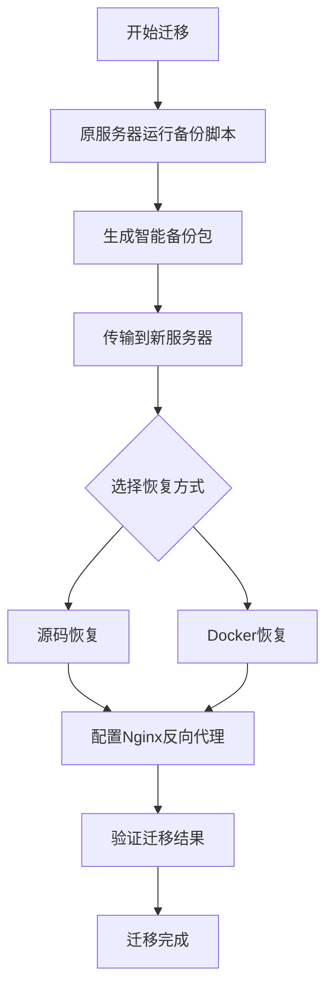

# Odoo 生产环境迁移工具套件


一套完整的、生产就绪的Odoo迁移工具，支持源码部署与Docker容器化部署的无缝切换。

## 📋 项目概述

**Odoo Migrate** 是一个自动化迁移工具套件，专门设计用于将生产环境的Odoo系统（包括自定义模块、数据库、文件存储和配置）从一台服务器安全、完整地迁移到另一台服务器。支持Odoo 17.0和18.0版本。

### 核心特性

- ✅ **智能环境探测** - 自动识别原服务器的Odoo配置、版本和依赖
- ✅ **严格版本控制** - 精确记录并匹配Python、Odoo、PostgreSQL版本
- ✅ **双恢复模式** - 支持源码部署（与原环境一致）和Docker容器化部署
- ✅ **中文PDF支持** - 自动解决中文PDF显示方块问题
- ✅ **智能Nginx配置** - 自动检测部署方式并配置正确的反向代理
- ✅ **依赖分析** - 智能分析Python依赖，确保自定义模块正常运行
- ✅ **一体化管理** - Docker部署时所有数据集中管理，便于迁移和备份

## 🚀 快速开始

### 环境要求

- **原服务器**: Odoo 17.0或18.0（源码部署）
- **新服务器**: Ubuntu 20.04/22.04 或 Debian 11/12
- **网络**: 两台服务器之间可传输文件（建议使用SCP或rsync）

### 完整迁移流程



## 📁 脚本套件详解

### 1. **`odoo_backup.sh`** - 智能备份脚本
在原服务器运行，创建完整的系统快照。

| 功能 | 说明 |
|------|------|
| **环境探测** | 自动识别Odoo进程、配置文件、数据库 |
| **版本记录** | 强制记录Python、Odoo、PostgreSQL精确版本 |
| **数据备份** | 数据库、文件存储、源代码、自定义模块 |
| **依赖分析** | 分析Python依赖，识别第三方库需求 |
| **字体收集** | 收集中文字体，解决PDF中文问题 |

**使用方法**:
```bash
# 下载脚本
wget -O odoo_backup.sh https://raw.githubusercontent.com/morhon-tech/odoo-migrate/main/odoo_backup.sh
chmod +x odoo_backup.sh

# 运行备份
./odoo_backup.sh
# 生成: odoo_backup_YYYYMMDD_HHMMSS.zip
```

### 2. **`restore_odoo.sh`** - 源码恢复脚本（默认）
按照原环境精确版本恢复，保持环境一致性。

| 功能 | 说明 |
|------|------|
| **版本匹配** | 严格按照备份记录的版本恢复 |
| **自动安装** | 安装匹配的Python、系统依赖 |
| **环境配置** | 创建虚拟环境，安装所有依赖 |
| **服务管理** | 配置systemd服务，自动启动 |

**使用方法**:
```bash
# 与备份ZIP文件放在同一目录
./restore_odoo.sh
```

### 3. **`restore_odoo_docker.sh`** - Docker Compose恢复脚本
使用Docker容器化部署，所有数据集中管理。

| 功能 | 说明 |
|------|------|
| **集中管理** | 所有数据存储在 `/opt/odoo_docker` |
| **版本控制** | 使用指定版本的Odoo镜像 |
| **便捷迁移** | 整个目录可打包迁移 |
| **管理工具** | 提供完整的服务管理脚本 |

**目录结构**:
```
/opt/odoo_docker/
├── docker-compose.yml
├── manage.sh           # 服务管理脚本
├── restore_database.sh # 数据库恢复工具
├── postgres_data/      # 数据库数据
├── odoo_data/          # Odoo文件存储
├── addons/             # 自定义模块
├── backups/            # 备份文件
└── config/             # 配置文件
```

**使用方法**:
```bash
# 与备份ZIP文件放在同一目录
./restore_odoo_docker.sh
```

### 4. **`configure_nginx.sh`** - 智能Nginx配置脚本
自动检测部署方式，配置反向代理和SSL证书。

| 功能 | 说明 |
|------|------|
| **部署检测** | 自动识别源码/Docker部署 |
| **端口适配** | 根据部署方式配置正确的上游端口 |
| **SSL支持** | 自动申请Let's Encrypt证书 |
| **性能优化** | 静态文件缓存，连接优化 |

**使用方法**:
```bash
# 在Odoo恢复后运行
./configure_nginx.sh
```

## 📖 详细使用指南

### 第一步：在原服务器备份
```bash
# 1. 克隆仓库或下载脚本
git clone https://github.com/morhon-tech/odoo-migrate.git
cd odoo-migrate

# 2. 运行备份脚本
chmod +x odoo_backup.sh
./odoo_backup.sh

# 3. 查看生成的备份文件
ls -lh ~/odoo_backup_*.zip
```

### 第二步：传输备份文件到新服务器
```bash
# 使用SCP传输
scp ~/odoo_backup_*.zip user@new-server:/home/user/

# 或者使用rsync（支持断点续传）
rsync -avzP ~/odoo_backup_*.zip user@new-server:/home/user/
```

### 第三步：在新服务器恢复

#### 选项A：源码恢复（推荐，与原环境一致）
```bash
# 1. 下载脚本
wget https://raw.githubusercontent.com/morhon-tech/odoo-migrate/main/restore_odoo.sh
chmod +x restore_odoo.sh

# 2. 将备份ZIP文件放在同一目录
# 3. 运行恢复脚本
./restore_odoo.sh
```

#### 选项B：Docker容器化恢复
```bash
# 1. 下载脚本
wget https://raw.githubusercontent.com/morhon-tech/odoo-migrate/main/restore_odoo_docker.sh
chmod +x restore_odoo_docker.sh

# 2. 运行恢复脚本
./restore_odoo_docker.sh

# 3. 使用管理工具
cd /opt/odoo_docker
./manage.sh status    # 查看状态
./manage.sh logs      # 查看日志
./manage.sh backup    # 备份数据库
```

### 第四步：配置域名访问
```bash
# 1. 下载配置脚本
wget https://raw.githubusercontent.com/morhon-tech/odoo-migrate/main/configure_nginx.sh
chmod +x configure_nginx.sh

# 2. 运行配置脚本
./configure_nginx.sh
# 按提示输入域名和管理员邮箱
```

## 🔧 技术特性

### 版本兼容性处理
```bash
# 备份时记录版本信息
Python版本: 3.10.12
Odoo版本: 17.0
PostgreSQL版本: 15.3

# 恢复时严格匹配
- 自动安装指定Python版本
- 使用对应版本的Odoo依赖
- 确保PostgreSQL版本兼容
```

### 中文PDF支持
- 自动安装中文字体包（文泉驿、思源字体）
- 配置wkhtmltopdf使用中文字体
- 解决中文发票/报表的方块问题

### 智能依赖分析
```bash
# 自动分析Python依赖
1. 虚拟环境包列表
2. 模块声明的external_dependencies
3. requirements.txt文件
4. 常见业务库检测（pandas, reportlab等）
```

## 📊 迁移前后对比

| 方面 | 迁移前 | 迁移后 |
|------|--------|--------|
| **部署方式** | 源码部署 | 可选源码/Docker |
| **数据管理** | 分散存储 | 集中管理 |
| **版本控制** | 手动记录 | 自动跟踪 |
| **恢复时间** | 数小时 | 15-30分钟 |
| **回滚能力** | 困难 | 一键恢复 |

## 🐛 故障排除

### 常见问题

#### Q1: 备份时找不到Odoo进程
**原因**: Odoo未运行或使用非常规启动方式
**解决**:
```bash
# 手动指定配置文件
ps aux | grep odoo  # 查找进程
# 或确保Odoo服务正在运行
sudo systemctl start odoo
```

#### Q2: 数据库恢复失败
**原因**: PostgreSQL版本不兼容或权限问题
**解决**:
```bash
# 检查PostgreSQL版本
psql --version
# 确保新服务器版本 >= 原服务器版本
# 手动恢复数据库
sudo -u postgres psql < database_dump.sql
```

#### Q3: 中文PDF仍显示方块
**解决**:
```bash
# 检查字体安装
fc-list :lang=zh
# 重新配置字体
sudo fc-cache -f -v
# 重启Odoo服务
sudo systemctl restart odoo
```

#### Q4: 自定义模块导入错误
**解决**:
```bash
# 查看缺失的Python包
cd /opt/odoo
source venv/bin/activate
pip install 缺失的包名
deactivate
sudo systemctl restart odoo
```

### 调试命令
```bash
# 查看Odoo日志
sudo journalctl -u odoo -f  # 源码部署
docker-compose logs -f odoo # Docker部署

# 验证服务状态
systemctl status odoo       # 源码部署
docker-compose ps          # Docker部署

# 测试端口访问
curl -I http://localhost:8069
curl -I https://your-domain.com
```

## 🤝 贡献指南

欢迎提交Issue和Pull Request！

### 开发流程
1. Fork本仓库
2. 创建功能分支 (`git checkout -b feature/amazing-feature`)
3. 提交更改 (`git commit -m 'Add some amazing feature'`)
4. 推送到分支 (`git push origin feature/amazing-feature`)
5. 开启Pull Request

### 代码规范
- 使用ShellCheck检查脚本语法
- 添加详细的注释说明
- 更新对应的文档
- 测试所有恢复场景

## 📄 许可证

本项目基于MIT许可证开源 - 查看 [LICENSE](LICENSE) 文件了解详情。

## 🙏 致谢

感谢所有贡献者和用户的支持！特别感谢：

- Odoo社区提供的优秀ERP系统
- PostgreSQL项目的强大数据库支持
- Docker团队提供的容器化解决方案
- Let's Encrypt提供的免费SSL证书服务

## 📞 支持与联系

- **问题反馈**: [GitHub Issues](https://github.com/morhon-tech/odoo-migrate/issues)
- **功能请求**: [Feature Requests](https://github.com/morhon-tech/odoo-migrate/issues/new?template=feature_request.md)
- **Bug报告**: [Bug Reports](https://github.com/morhon-tech/odoo-migrate/issues/new?template=bug_report.md)

---

**提示**: 在生产环境使用前，建议在测试环境完整演练整个迁移流程。确保有完整的备份后再执行迁移操作。

---

<div align="center">
  <sub>由 ❤️ 构建 | 适用于 Odoo 17.0+ | Morhon Technology</sub>
</div>
